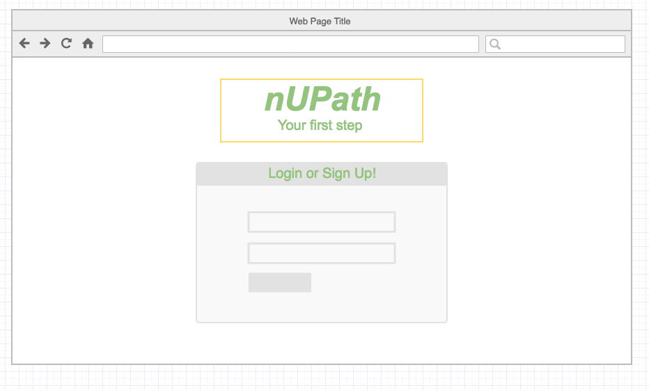

#nUPath
---
 
###About:

In the modern age of social media, students have various platforms for communicating with friends and family alike.  What’s missing is a place for students to connect to other students without the noise of status updates and tweets.  **nUPath** provides a noise free, safe zone for students to discuss academia and their achievements.   

**nUPath** is designed with the purpose of helping students get a jumpstart on their career path after graduation.  High school Juniors and Seniors can use nUPath as their first online resume/portfolio.  College students can use nUPath to enhance their resume building skills and gain access to other universities and employers.  Through nUPath, students can connect worldwide to teachers, professors, faculty members, and fellow students.  

 
[Visit site here](https://stormy-tundra-22793.herokuapp.com/login)

Dash board of the site:

---

###Acknowledgement

Philippe Luchansky

TA Conrad

Roland Abregorivas

Team KAT

---

###Content
*	Access to site
	1. Remote
	2. Locally
* Instructions
* Data Modeling
* Technologies Used
* Lags
* User Stories
* Future implementations
* Contribution
* Acknowledgement
     

---
  
###Technologies Used
>* Languages: Javascript, HTML5/CSS
>* Web-Application Frameworks: Node.js [Express | Socket.IO | SocketStream]
>* Front-end Libraries: jQuery, Bootstrap
>* Database: MongoDB
>* Object Relational/Document Mappers: Mongoose
>* CSS pre-compilers: SaSS
>* Version Control: Git/ Github
>* Deployment: Heroku

  

---

###Access to site

###Instructions

### Data Modeling

---

###User Stories

User POV:

1. As a user, I can create a profile by providing their name, email address and school affiliation.

2. As a user, I can build their online portfolio by completing the achievements form.

3. As a user, I have access to a newsfeed where they can post questions or comments.

4. As a user, I can make comments on other users' post.

5. As a user, I can send messages to other users through the direct messaging feature.

---

###Future implementations

1. As a user, I want to upload photos.

2. As a user, I want to follow other users.

3. As a user, I want to have a link to my profile which I can send to schools, universities, and employers so they can view my profile.

4. As a user, I want to make comments on other users' pages (for example, congratulate a student for an achievement).

###Contribution:

###Acknowledgements:
Credits: 

* npm packages:

npm Packeges| Author/Authors
--------------|------
express | ganey
